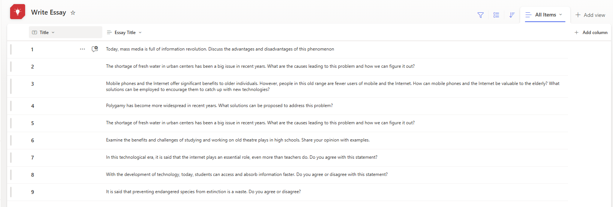
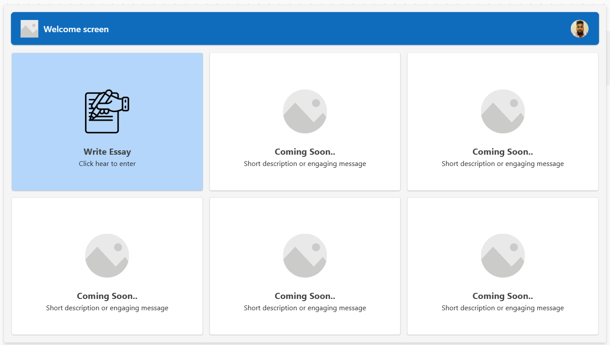
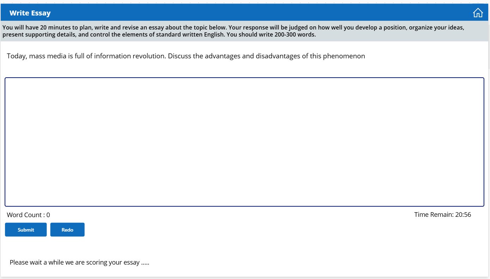
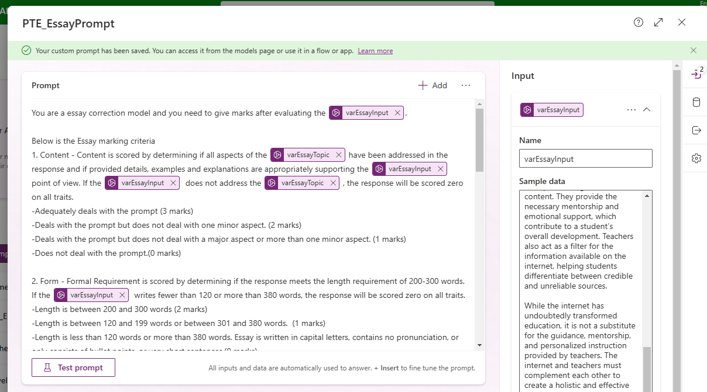

# AI-Based Essay Marking Application

## Overview

This is an AI-based essay marking application designed to provide instant results and feedback on your essay writing skills. The app simulates a testing environment similar to the PTE exam, where you are given a random essay topic, a 20-minute timer, and the opportunity to self-evaluate your essay performance.

The essay topics are automatically generated from a SharePoint list, ensuring a varied and dynamic experience. After completing the essay, you can immediately receive feedback on your writing and reattempt the same question if you wish.

## Features

- **AI-Powered Essay Evaluation**: Get instant results and feedback from AI on your essay writing skills.
- **20-Minute Timer**: You have 20 minutes to write your essay, simulating a real-time exam scenario.
- **Automatic Topic Generation**: Essay topics are randomly generated from a SharePoint list, ensuring a fresh experience with every attempt.
- **Redo Option**: The option to redo the same essay topic to practice and improve.
- **Self-Evaluation**: Evaluate your writing skills and receive AI-generated suggestions for improvement.

## Technology Stack

- **PowerApps**: The platform used to create the application and design the user interface.
- **AI Integration**: Leverages AI algorithms for instant essay evaluation and feedback.
- **SharePoint**: Used to store and retrieve essay topics for random selection.
- **Power Automate**: For managing workflows related to data processing and interactions with SharePoint.

## How It Works

1. **Essay Topic Generation**: When you open the app, a random essay topic is fetched from the SharePoint list and displayed.
2. **Start Writing**: You have 20 minutes to write your essay in the provided text box. A countdown timer will track the remaining time.
3. **AI Evaluation**: Once you submit your essay, AI evaluates your writing based on various criteria and provides instant feedback.
4. **Review and Redo**: You can review the feedback and choose to redo the essay if you wish to improve your score.

## Getting Started

### Prerequisites

- **PowerApps**: A Microsoft PowerApps account is required to use this app.
- **SharePoint**: Access to a SharePoint list where essay topics are stored.
- **AI API**: Access to an AI evaluation API (e.g., Microsoft Cognitive Services or a custom model) for essay feedback.

### Screenshots

### Usage

1. Launch the app in PowerApps.
2. A random essay topic will appear on the screen.
3. Start writing your essay within the time limit.
4. Once the essay is submitted, AI feedback will be shown instantly.
5. You can redo the same essay topic as needed to improve your writing.

---

## Regards - Shashika Hettiarachchi ❤️
