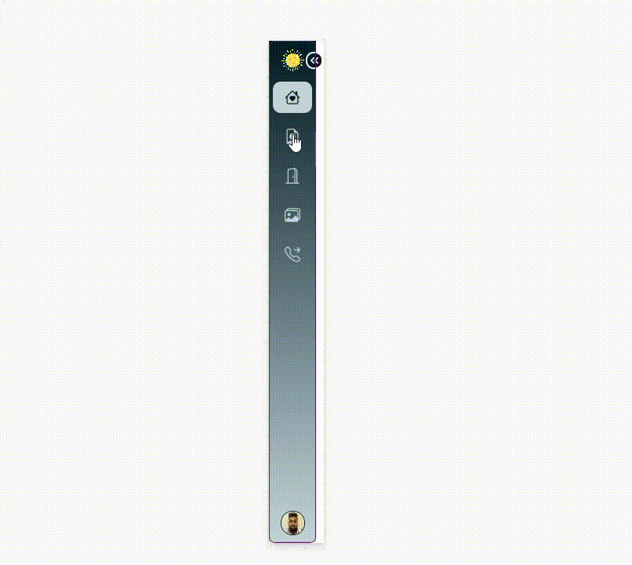
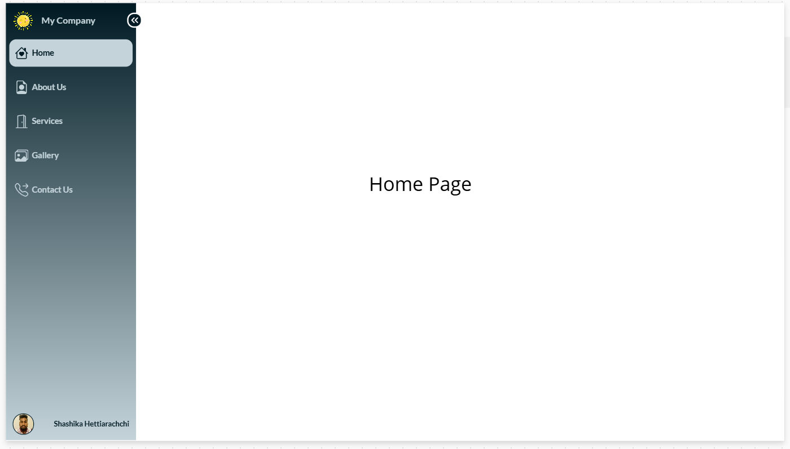
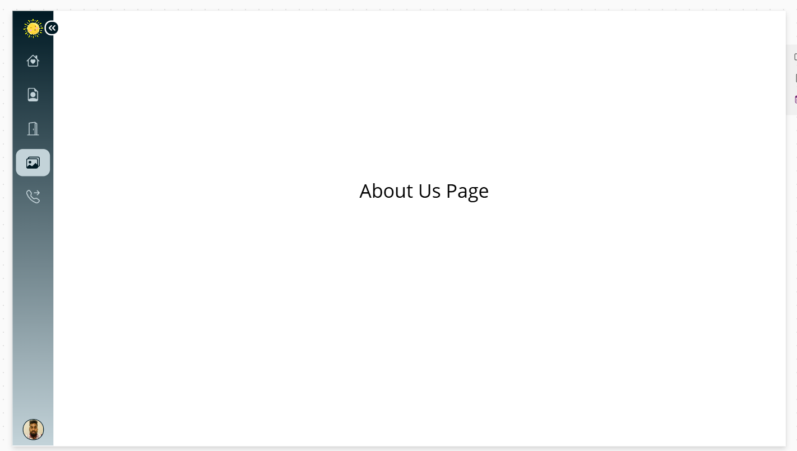
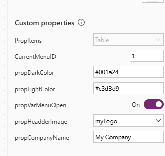

# Building a Sleek and Expandable Left Navigation Component in Power Apps

## Overview

A well-designed navigation menu is essential for user experience in any app, and Power Apps provides a flexible platform for creating custom components tailored to your app’s needs. In this blog, I’ll walk you through the steps to create an expandable, sleek left-navigation menu component with customizable properties. This guide uses the reference image for the final look, with an emphasis on elegance and responsiveness.

## Features

- **Expandable and Collapsible Design**: A Boolean property (propVarMenuOpen) toggles the menu’s width between expanded and collapsed states.
- **Customizable Menu Items**: A property (propItems) allows you to dynamically define menu items, including icons, names, and navigation screens.
- **Themed Background**: Two properties (propDarkColor and propLightColor) enable gradient theming.
- **Company Branding**: A company logo (propHeadderImage) and name (propCompanyName) are prominently displayed at the top.
- **User Profile at the Bottom**: Displays the logged-in user’s profile picture and full name.

## Technology Stack

- **PowerApps**: The platform used to create the application and design the user interface.

---

## Custom Properties

| Property Name      | Type    | Description                                  |
| ------------------ | ------- | -------------------------------------------- |
| `propItems`        | Table   | Defines the menu items (name, icon, screen). |
| `propVarMenuOpen`  | Boolean | Tracks whether the menu is expanded or not.  |
| `propDarkColor`    | Color   | Sets the darker part of the gradient.        |
| `propLightColor`   | Color   | Sets the lighter part of the gradient.       |
| `propHeadderImage` | Image   | Displays the company logo.                   |
| `propCompanyName`  | Text    | Displays the company name.                   |

---

### Screenshots

## Regards - Shashika Hettiarachchi ❤️
