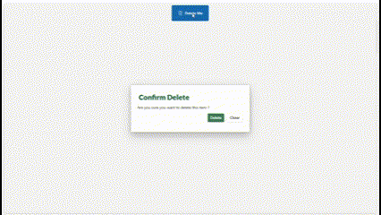
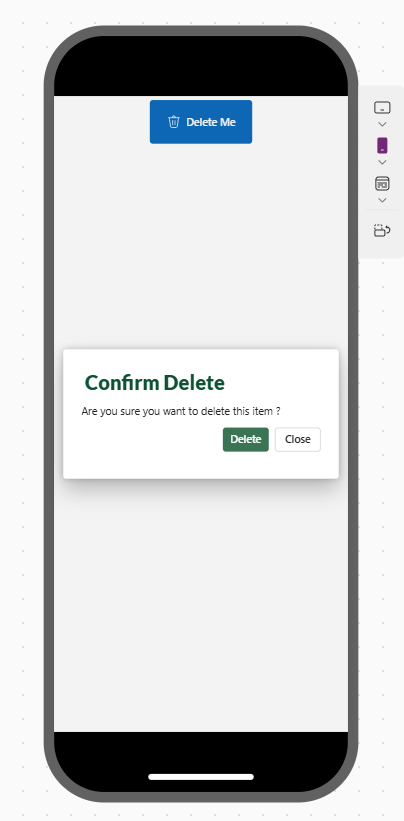
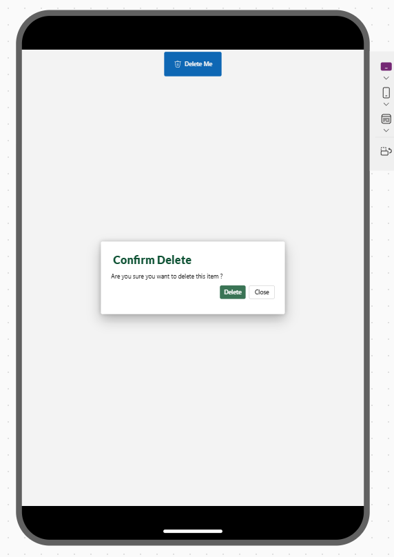
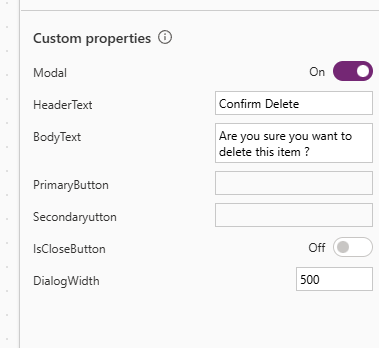

# Fully Customizable Responsive Modal-Popup Component in Power Apps

## Overview

This reusable Power Apps canvas component that provides a modal or non-modal dialog box with two configurable buttons (Primary and Secondary). This component allows customization of the header, body text, visibility settings, and button properties.

## Features

- Configurable header and body text
- Modal and non-modal support
- Primary and Secondary button customization
- Close button support
- Dynamic width and height adjustments
- Uses Power Apps HTML Viewer to auto-adjust button widths based on text length

## Technology Stack

- **PowerApps**: The platform used to create the application and design the user interface.
---

### Screenshots

## Regards - Shashika Hettiarachchi ❤️
