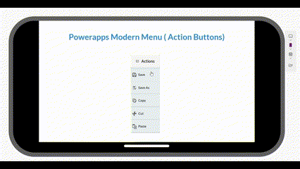

# Power Apps Modern Menu (Action Dropdown Button)

## Overview

The Power Apps Modern Menu component provides a configurable dropdown button with action menu items. This sleek and responsive design allows users to customize button properties, including width, name, color, font size, and menu items.



## Features

- Configurable button width, name, color, and font size.
- Dynamic menu items.
- Responsive and modern design.
- Easy integration into Power Apps Canvas apps.


## Technology Stack

- **PowerApps**: The platform used to create the application and design the user interface.
---
## How to Use

- Add the component to your app.
- Configure the ActionItems property with a table of menu items:
- Modify the properties using Power Apps formulas
   ```powerapps
    Table(
	{ MenuName: "Action 1", MenuIcon: "Icon1" },
	{ MenuName: "Action 2", MenuIcon: "Icon2" }
	)
   ```
- Set ButtonName to the desired label, e.g., "Options".
- Adjust FontSize and AutoWidth as needed.
- Use ButtonOnSelect to define custom logic for menu actions.


### Screenshots


## Regards - Shashika Hettiarachchi ❤️
