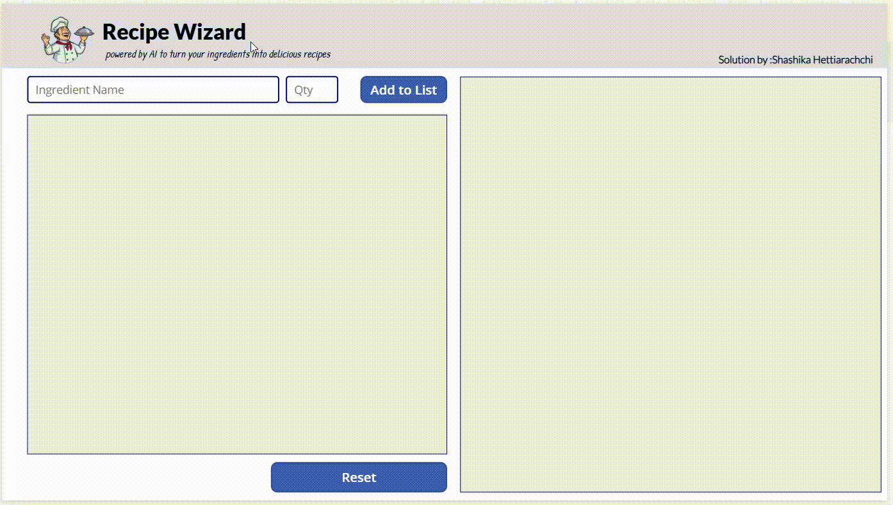

# Recipe Wizard using PowerApps and Generative AI

Recipe Wizard is a user-friendly application that transforms your kitchen ingredients into delicious recipes, all powered by Generative AI. Simply input what you have on hand, and let the app do the magic!

## Features

- **Ingredient Input**: Easily add ingredients and their quantities.
- **Recipe Generation**: Get tailored recipes based on your available ingredients.
- **User-Friendly Interface**: Intuitive design for a seamless cooking experience.
- **Reset Functionality**: Clear your ingredient list with a single click.

## Getting Started

### Create AI Prompt

1. **Access PowerApps Portal**  
   Navigate to the [PowerApps portal](https://make.powerapps.com).

2. **Go to AI Hub**  
   Select **AI Hub** and then click on **AI Prompt**.

3. **Create Text with GPT**  
   Choose **Create text with GPT using prompt**.

4. **Update the Prompt and Inputs**  
   Modify the prompt and inputs as needed (refer to the image below).  
   

5. **Test and Save the Prompt**  
   After making your changes, test the prompt to ensure it works as expected, then save it.

---

### Create a Blank Canvas App

1. **Set Up the App**  
   Create a new blank canvas app.

2. **Add Input Controls**  
   Add two text boxes: one for **'Ingredient Name'** and another for **'Qty'**.

3. **Add a Button and Gallery**  
   Include a button control and a blank gallery.

4. **Bind Textbox Inputs to the Gallery**  
   Set the gallery’s data source to bind the inputs from the text boxes into a variable.

5. **Import the AI Data Prompt**  
   Import the AI Prompt data connection into canvas app

6. **Add an AI Prompt Button**  
   Include a button to display the AI-generated prompt.

### Enjoy cooking with AI! Let your ingredients be your guide, and let AI sprinkle some magic—because cooking should be fun!

## Regards - Shashika Hettiarachchi ❤️
