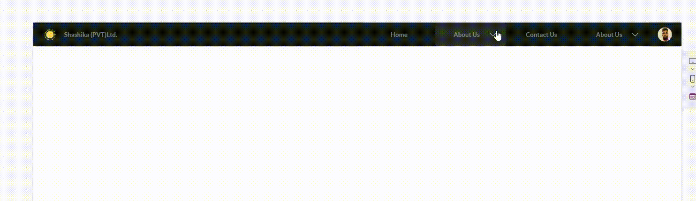
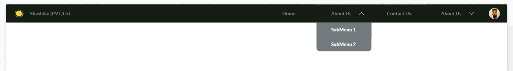
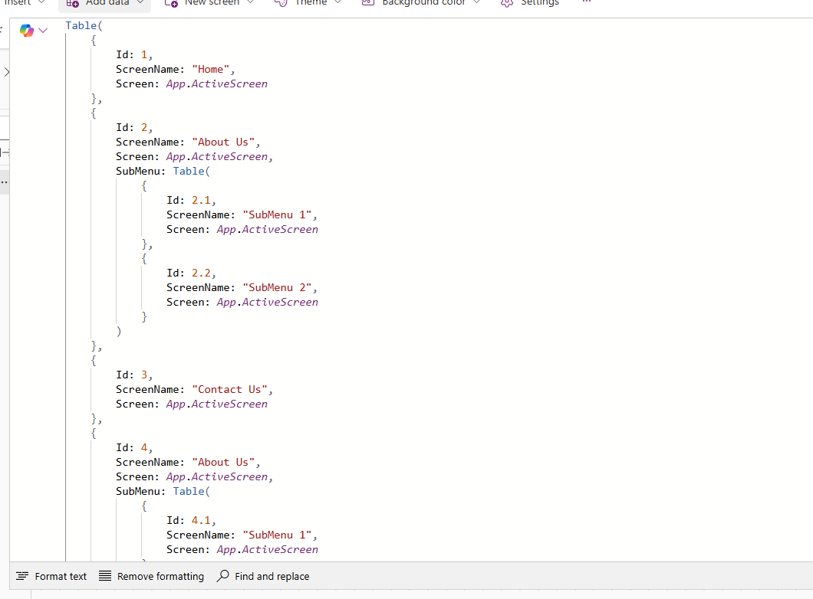
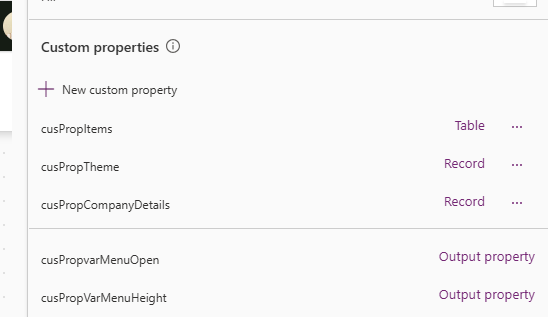

# Building a Top Navigation Menu Component in Power Apps

## Overview

This is a Power Apps custom component designed to create a responsive and customizable top navigation menu. It supports nested submenus, company branding, and theming for enhanced user interface design.



## Features

- **Dynamic Menu**: Supports main menu items and nested submenus.
- **Company Branding**: Includes options for company logo and name.
- **Customizable Theme**: Offers configurable colors and styles for the menu and submenus.
- **Responsive Design**: Automatically adjusts based on screen width.
- **Event Handling**: Provides navigation and submenu toggle functionality.

---

## Technology Stack

- **PowerApps**: The platform used to create the application and design the user interface.

---

## Component Properties

### 1. **cusPropCompanyDetails**

- **Type**: Record
- **Description**: Defines the company branding details.
- **Structure**:
  ```powerfx
  ={
    CompanyName: "Your Company Name",
    CompanyLogo: 'MediaFileReference'
  }
  ```

### 2. **cusPropCompanyDetails**

- **Type**: Table
- **Description**: Specifies the menu structure, including main menu and submenu items.
- **Structure**:
  ```=Table(
    {
        Id: 1,
        ScreenName: "Home",
        Screen: App.ActiveScreen
    },
    {
        Id: 2,
        ScreenName: "About Us",
        Screen: App.ActiveScreen,
        SubMenu: Table(
            {
                Id: 2.1,
                ScreenName: "SubMenu 1",
                Screen: App.ActiveScreen
            },
            {
                Id: 2.2,
                ScreenName: "SubMenu 2",
                Screen: App.ActiveScreen
            }
        )
    }
  )
  ```

### 3. **cusPropTheme**

- **Type**: Record
- **Description**: Defines the color scheme and style settings.
- **Structure**:
  ```={
    BackgroungColor: ColorValue("#151c14"),
    BackGroundselectedColor: ColorValue("White"),
    BackGroundHoverColor: RGBA(190, 190, 240, 0.1),
    TextColor: ColorValue("Gray"),
    TextSelectedColor: ColorValue("SlateBlue"),
    MenuColor: ColorValue("#4f5afe"),
    MenuSelectedColor: ColorValue("#3f484b"),
    SubMenuColor: ColorValue("#838b8e"),
    SubMenuSelectedColor: ColorValue("#727a7e"),
    SubMenuTextColor: ColorValue("White")
  }
  ```

### 4. **Height**

- **_=If(COMP_TopMenuNav.cusPropvarMenuOpen, COMP_TopMenuNav.cusPropVarMenuHeight, 50)_**

### 3. **Width**

- **_=App.DesignWidth_**

---

## Usage

- Add the COMP_TopMenuNav component to your app.
- Configure the following properties:
- cusPropCompanyDetails for branding details.
- cusPropItems to define menu items and submenus.
- cusPropTheme to customize colors and styles.
- Link menu items to their respective screens using the Screen property.
- Handle navigation using the Navigate() function in the btnSelectMenu control.

### Screenshots





## Regards - Shashika Hettiarachchi ❤️
